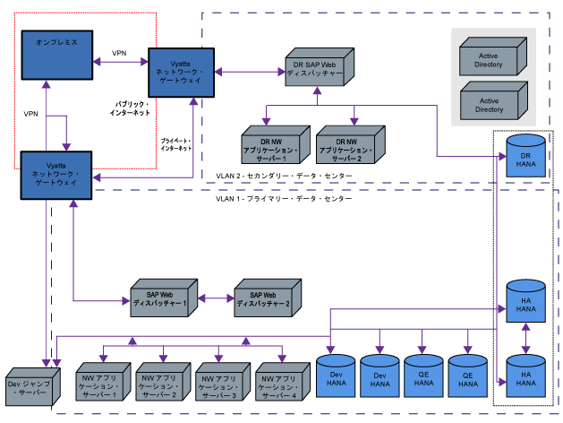

---

copyright:
  years: 2018
lastupdated: "2018-03-15"

---

{:shortdesc: .shortdesc}
{:codeblock: .codeblock}
{:screen: .screen}
{:new_window: target="_blank"}
{:pre: .pre}
{:table: .aria-labeledby="caption"}

# SAP リファレンス・アーキテクチャーの背後にあるアーキテクチャーについて
{: #architecture}

図 1 のアーキテクチャー例は、お使いのアーキテクチャーとは異なる可能性がありますが、{{site.data.keyword.cloud}} ベースの配備の一般的な概念を示しています。オンプレミス・システムは、インターネットを介して {{site.data.keyword.cloud_notm}} インフラストラクチャーに接続されています。

現在の環境の注文と配備が完了したら、管理 VPN を介して {{site.data.keyword.cloud_notm}} インフラストラクチャーに接続します。この VPN は、オンプレミス・システムをクラウド・ベースのシステムに接続する際には不十分である可能性があるため、Vyatta ネットワーク・アプライアンスを {{site.data.keyword.cloud_notm}} 環境に配備します。処理能力の向上と待ち時間の短縮という要件に応えられるように、クラウド環境へのイーサネット回線ハンドオーバーもサポートされています。

図 1 に示されている 2 つの異なるデータ・センターは、SAP NetWeaver と SAP HANA のどちらも、複数の SAP Infrastructure as a Service (IaaS) 認定サーバーで構成されています。図のサーバーまたは仮想マシンは、現在の環境および使用中のデータベース・テクノロジーによって異なる可能性があります。さらに、アーキテクチャー概要に含まれる SAP HANA データは、災害復旧 (DR) のためにプライマリー・データ・センターからセカンダリー・データ・センターに転送されます。他のデータベースでは、図 1 のようなセットアップが可能ですが、セットアップは異なります。

図 1 では、DR データ・センター・サイトで、複製されたシステムが DR 機能を維持するように構成されています。これらの機能は別々の層で実装する必要があります。詳しくは、[災害復旧の考慮事項](/docs/infrastructure/sap-reference-architecture/sap-ra-recommendations.html#dr)を参照してください。 

図 1. リファレンス・アーキテクチャー例

## SAP システム
{: #sap-systems}

SAP システム (Advanced Business Application Programming (ABAP)、Java、SAP HANA) には、ユーザー管理のための詳細な権限オブジェクト・セットがあります。そのため、デスクトップまたはその他のフロントエンド・デバイスから {{site.data.keyword.cloud_notm}} ベースの環境へのリモート・アクセスのみをセットアップする必要があります。クラウド環境では、エンド・ユーザーのアクセスを付与および管理する必要はありません。複数のユーザーがそれぞれの責任に応じて、特定の GUI でデータベースにアクセスしたり、コマンド・ライン・レベルでデータベースにアクセスしたり、待ち時間の制限を受けてリモート・デスクトップ・プロトコル・ベースでアクセスしたりする必要があります。このタイプのリモート・アクセスを管理するには、環境内に「ジャンプ・ホスト」を配備して、このようなタイプのシナリオの中心的なアクセス・ポイントとして機能させることができます。これらの特定の要件とは別に、ユーザーは企業ネットワーク内のクラウド・ベースのシステムにアクセスすることができ、ユーザーを特定の方法で管理する必要はありません。

## ネットワーク
{: #network}

{{site.data.keyword.cloud_notm}} 環境内の任意のデバイスを注文する際には、内部 LAN およびオプションの外部 LAN アクセスを選択します。外部アドレスはルーティング可能なパブリック IP アドレスであるため、慎重に取り扱う必要があります。内部アドレスは、注文された VLAN によって決まり、VLAN のサブ範囲 10.0.0.0/8 から選択されます。複数の VLAN を注文すると、ネットワーク設計およびセキュリティー要件によって、環境やトラフィック・タイプを使い分けることができます。

構成済みのファイアウォールを使用するパブリック・インターフェースでは、一部のシナリオ (短期間のラピッド・プロトタイピング、重要でないデータによる PoC (概念検証) など) をカバーすることはできますが、多くの場合、ファイアウォール・デバイスの導入を検討する必要があります。リファレンス・アーキテクチャー例では実動シナリオをマップしているため、パブリック・ネットワーク・インターフェースは範囲外です。

## Vyatta ネットワーク・ゲートウェイ
{: #vyatta}

Vyatta は、IPv4 と IPv6 のどちらの場合でも、ソフトウェア・ベースの仮想ルーター、仮想ファイアウォール/NAT、および VPN 機能を提供します。ユーザーが {{site.data.keyword.cloud_notm}} ベースのシステムにリモート接続する場合、これらのデバイスは、サイド・ツー・サイド VPN といわゆる「ロード・ウォリアー VPN」(アクセス・ポイント) のエンドポイントとして機能します。さまざまな種類の VPN テクノロジー (IPSec、または OpenVPN などの SSL VPN トンネル) を使用できます。使用する SAP テクノロジーに応じて、これらの VPN 接続を使用して、従来の GUI テクノロジーおよびブラウザー・ベースの SAP UI5 テクノロジー用に SAP システムを相互接続 (または非 SAP システムに接続) することができます。Vyatta ゲートウェイの背後で SAP Web ディスパッチャーを接続すると、ロード・バランシングやシングル・サインオン・シナリオなど、さらに多くの機能を使用できます。SAP Web ディスパッチャーについて詳しくは、[可用性](/docs/infrastructure/sap-reference-architecture/sap-ra-recommendations.html#availability)を参照してください。

Vyatta デバイスは、最大 10 Gbps の処理能力を持つ高可用性クラスター構成に配備できます。詳しくは、[Vyatta ゲートウェイ](https://console.bluemix.net/docs/infrastructure/subnets/about.html#vyatta-gateways)を参照してください。

## ジャンプ・ボックス・サーバー
{: #juump_box}

SAP システムにはユーザー管理が組み込まれているため、ユーザーを集中管理する必要はありません。もちろん、ユーザーの集中管理をセットアップすることもできます。詳しくは、[Central User Administration](https://help.sap.com/saphelp_nw73/helpdata/en/bf/b0b13bb3acd607e10000000a11402f/frameset.htm) を参照してください。

ジャンプ・ボックス・サーバーを使用すると、コマンド・ライン・アクセス・ベースのツールや SAP HANA Studio などの他の専用ツールを使用して、特定のユーザーに {{site.data.keyword.cloud_notm}} 環境への低レベルのアクセスを付与することができます。データベース管理ツール、およびツールへのアクセスを許可されたユーザーは、ジャンプ・ボックス・サーバー上で集中管理されます。ユーザーは、デスクトップからリモート・デスクトップ・プロトコル (VPN ゲートウェイ経由でルーティングされる) を介して {{site.data.keyword.cloud_notm}} 環境にログインできます。

## SAP サーバー - SAP HANA および SAP NetWeaver
{: #sap_servers}

{{site.data.keyword.IBM_notm}} は、{{site.data.keyword.cloud_notm}} for SAP Applications 製品を通じて、SAP HANA および SAP NetWeaver 用のさまざまなサーバーを提供しています。これらのサーバーは、オペレーティング・システム (OS) (Red Hat Linux、SUSE Linux、Microsoft Windows Server、または VMware ESX ハイパーバイザーを使用して配備) を選択した {{site.data.keyword.baremetal_short}} です。SAP NetWeaver 認定サーバーについて詳しくは、[SAP Note 2414097](https://launchpad.support.sap.com/#/notes/2414097) を参照してください。ハイパーバイザーでは、SAP Note 2414097 に記載されているオペレーティング・システムの 1 つをゲスト OS として配備することに注意してください。 

SAP HANA サーバーには、SAP HANA 用の SAP のストレージ重要パフォーマンス指標 (KPI) を満たす、事前選択されたストレージ・レイアウトが付属しています。これらのレイアウトを変更することはできません。また、SAP HANA の外部ストレージは使用しないことをお勧めします。バックアップやその他の目的には、異なるプロトコル (NFS、CIFS、iSCSI) でアクセス可能な異なる品質の外部ストレージを使用できます。また、SAP NetWeaver サーバーの場合は、サポートされる他のデータベース・システムを外部ストレージで実行するように選択することもできます。

SAP HANA または SAP NetWeaver をベースとするすべての SAP ソフトウェア・ソリューションには、SAP Business Suite 全体が含まれており、SAP S/4HANA を {{site.data.keyword.cloud_notm}} 環境に配備することができます。これら以外のソフトウェア・コンポーネントについては、SAP サポートに問い合わせる必要があります。SAP サイジング・プロセスに従ってプロジェクトに適切なサーバー・サイズを決定し、SAP HANA または SAP NetWeaver のいずれかの製品について、リストされているサーバーから選択します。 

SAP HANA 認定サーバーについて詳しくは、[Certified and Supported SAP HANA Hardware Directory](https://www.sap.com/dmc/exp/2014-09-02-hana-hardware/enEN/iaas.html#categories=IBM%20Cloud) を参照してください。

SAP HANA サイジング・プロセスについて詳しくは、[4. サーバーのサイジング](https://console.bluemix.net/docs/infrastructure/sap-hana/hana-size-server.html#size_the_server)を参照してください。 

SAP NetWeaver のサイジング処理について詳しくは、[4. サーバーのサイジング](https://console.bluemix.net/docs/infrastructure/sap-netweaver/sap-size-server.html#size_the_server)を参照してください。
